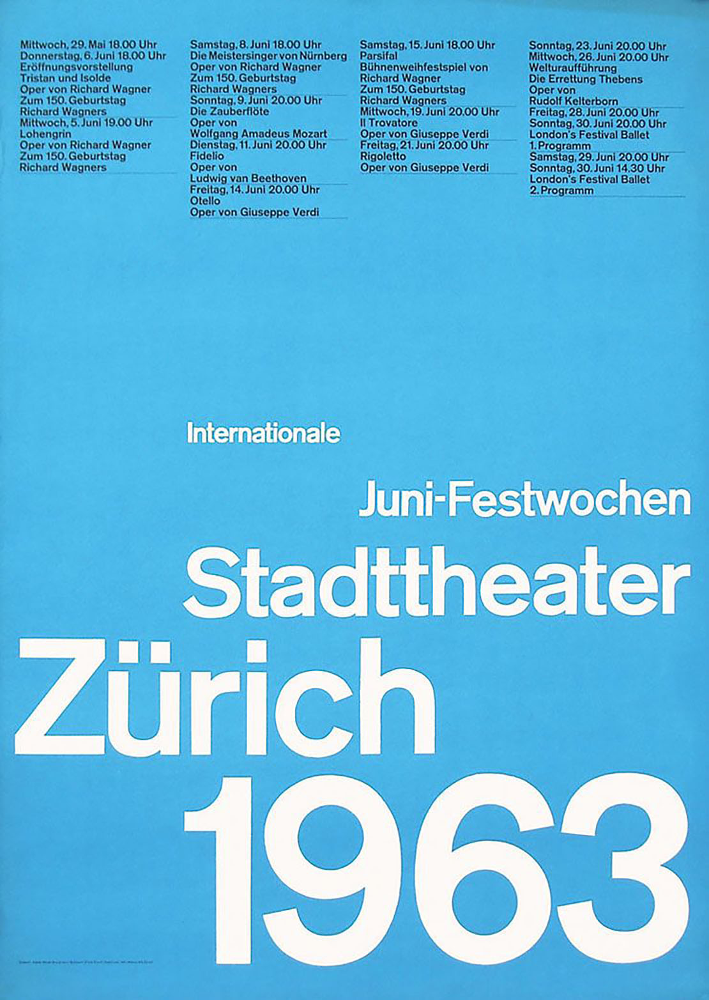

<!-- Every README should start with an H1 -->
# Week 2 Swiss Poster Challenge - ReadMe
<!-- A one sentence description of the project or assignment -->
This is my second week's homework assignment for Dynamic Web Dev. 

<!-- It is good practice to add an about or summary -->
## About

For this assignment, we were asked to pick a swiss poster design and replicate it to stay within its grid pattern regardless of the window size.

<!-- It is essential to describe how to set up your project -->
## Setup

This project requires very little setup - just open it in any web browser!

<!-- Any knowledge or tools you will need before hand -->
### Prerequisites

1. A text editor - preferably [VS Code](https://code.visualstudio.com/)
2. An understanding of markdown syntax. You can learn about markdown at this [Markdown Guide](https://www.markdownguide.org/getting-started/)

<!-- any installation needs should be defined -->
### Installation

For this particular project, there are no specific installation requirements.

<!-- Write instructions on how to start working on your project -->
### Develop

To develop this document, you can follow the steps provided below:
1. create a fork of this project on Github
2. ping the author of this repo via Github Issues to see if they are looking for contributions on the specific feature you're looking to add
3. open the file in VS Code and make updates 
4. add and commit those changes in your forked github repo
5. make a pull request specifying what additions and changes were made
6. have a nice chat and communication with me about those changes. 
7. celebrate the contribution! 

<!-- Notes about the deployment -->
### Deployment

This project is hosted on Github. Github renders markdown files.

## Built with

* [VS Code](https://code.visualstudio.com/)
* [Github](https://github.com)
* [Glitch](https://glitch.com)
* [Duck Duck Go](https://duckduckgo.com/?q=swiss+poster+design&t=ffab&iax=images&ia=images)

## Authors

* [Lillian Ritchie](https://github.com/lillianritchie)

## Code of Conduct

Please read the [CODE OF CONDUCT](https://www.mozilla.org/en-US/about/governance/policies/participation/) 

## License

This is README template is licensed according to [Attribution 4.0 International (CC BY 4.0) ](https://creativecommons.org/licenses/by/4.0/)

<!-- thank and reference all the things that made your project happen -->
## Acknowledgements

* Joseph Muller (Original Poster Design)

***
***
***

<!-- For your assignments you might consider  -->
# Notes & Process
* I made all of the element sizes in this site relative to the window width to maximize its ability to stay within the general grid plan.
* Since the event detail text can get very small, I added a hover feature that enlarges event text when you hover over the event (the text doesn't enlarge TOO much, because larger sizes broke the grid and/or spilled outside of the window)
<!-- How you built this project - Include images, gifs, and notes here -->
## Process & Documentation

<!-- Any specific challenges or struggles documented -->
## Challenges & Struggles
* I'm struggling with borders- the original poster has a very thin line between event details, and I wanted to place borders only on the bottoms of the list boxes... but for whatever reason I can't seem to make that work!

<!-- Any questions you have -->
## Questions
* How can you place border lines just on one side of a border box? is that possible? Is there a way to just insert a simple line?

<!-- References for resources and inspiration -->
## References
This project is based off of this poster by Joseph Muller:

